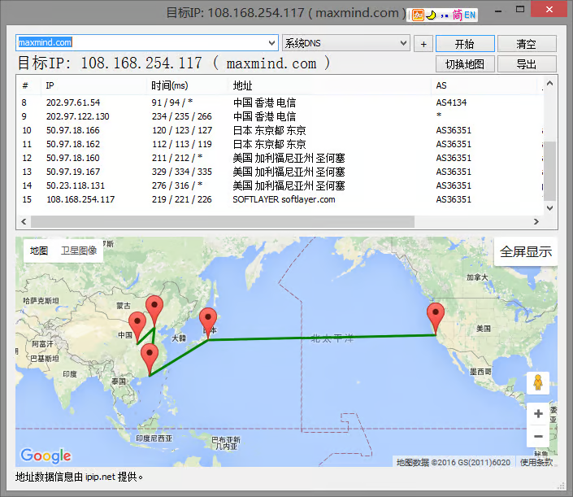
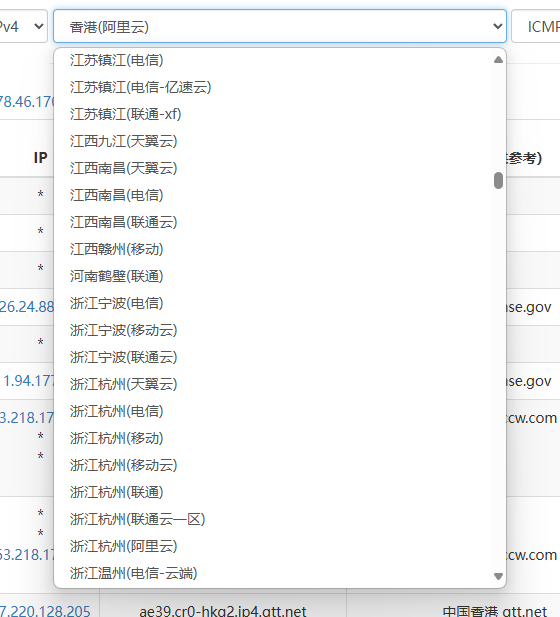
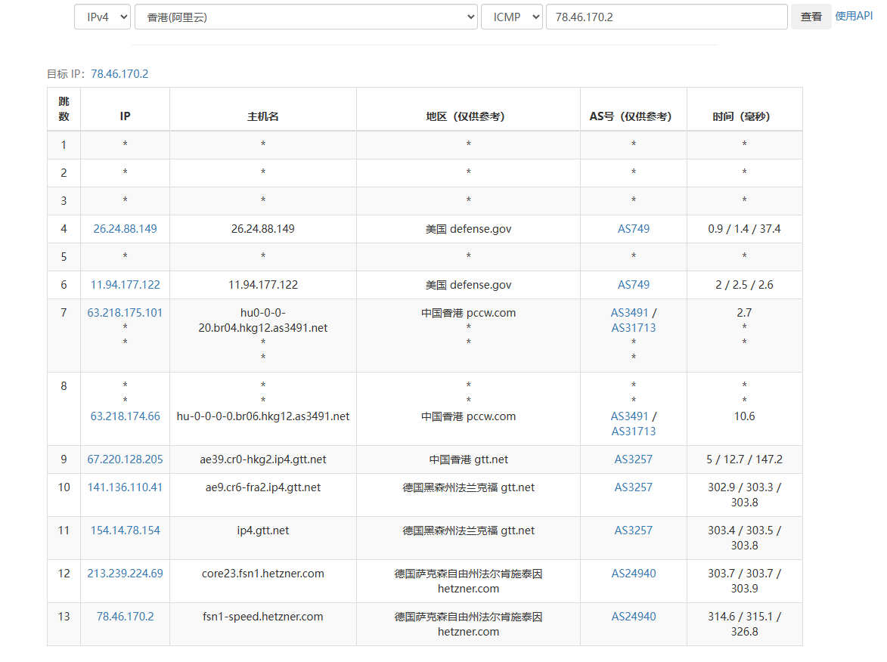

# IPIP.NET

IPIP.NET 是一家专注于 IP 地理位置和 IP 画像数据的公司，提供多种 IP 数据库和工具。 主要产品包括 IP 地理位置数据库，基于 BGP/ASN 数据和全球网络监测点，提供城市级 IP 地域数据标注。 提供的服务包括网站速度测试、网络速度检测、在线 ping 检测、DNS 查询、路由跟踪查询等。 IPIP.NET 的客户涵盖广告、网络安全、电商、娱乐、金融等多个行业。 提供的工具如 BestTrace 客户端，可以查询 IP 地址的地理位置、所属 ASN、端口开放信息等。

<figure><figcaption></figcaption></figure>

### 主要产品 

* IP 地理位置数据库：基于 BGP/ASN 数据，提供城市级 IP 地域数据标注。
* IP 风险画像：提供 IP 风险画像在线服务。
* IPv4 数据库：提供 IPv4 数据库试用版。
* BestTrace 软件：查询 IP 地址的地理位置、所属 ASN、端口开放信息等。

<figure><figcaption></figcaption></figure>

### 工具和服务 

* [TraceRoute](https://tools.ipip.net/traceroute.php)
* [Ping](https://tools.ipip.net/ping.php)
* [端口检测](https://tools.ipip.net/portcheck.php)
* [WebPing](https://tools.ipip.net/webping.php)
* [ASN](https://tools.ipip.net/as.php)
* [CDN](https://tools.ipip.net/cdn.php)
* [HttpHead](https://tools.ipip.net/httphead.php)
* [DNS](https://tools.ipip.net/dns.php)
* [域名查询](https://tools.ipip.net/domain.php)
* [IP反查域名](https://tools.ipip.net/ipdomain.php)
* [MyIP.LA](https://www.myip.la/)
* [IPv6Test](https://v6t.ipip.net/)
* [IPv6网站测试](https://v6sc.ipip.net/)
* [BT 网络监控](https://labs.ipip.net/bt.html)
* [坐标拾取](https://tools.ipip.net/map.php)
* [转换工具](https://tools.ipip.net/convert.php)

### 特色

* 极多的检测节点，包括各省市区国家的不同运营商

<figure><figcaption></figcaption></figure>

* 可自定义监测节点，所有节点均可指定调用

<figure><figcaption></figcaption></figure>

* 宽裕的免费额度

<table data-view="cards"><thead><tr><th></th><th></th><th></th><th data-hidden data-card-cover data-type="files"></th></tr></thead><tbody><tr><td>官网地址↓</td><td><a href="https://tools.ipip.net/">https://tools.ipip.net/</a></td><td></td><td><a href="../../.gitbook/assets/{2F2B72E0-15C9-4CE9-9E6F-B024340D796D}.png">{2F2B72E0-15C9-4CE9-9E6F-B024340D796D}.png</a></td></tr></tbody></table>
