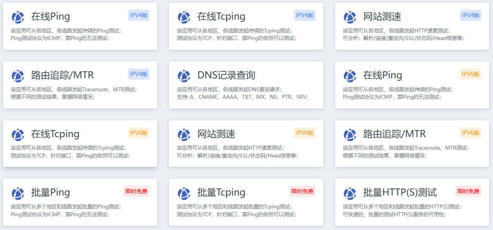
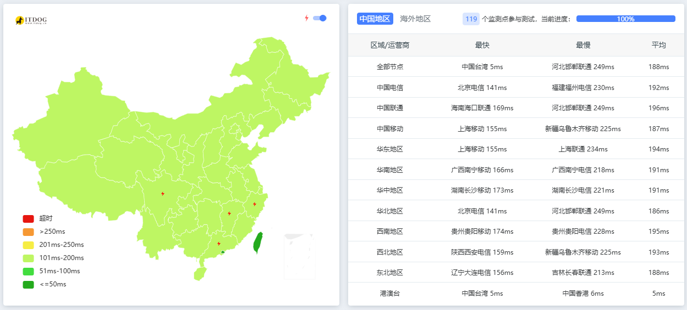

# ITDOG

ITDOG是一款专业的网站测试工具，提供多种功能以帮助用户测试和优化网站性能。主要功能包括Ping测试、TCPING测试、网站测速、HTTP测速、API测速、路由追踪、在线MTR和DNS查询。ITDOG支持IPv4和IPv6的测试，适用于不同网络环境下的网站性能评估。该工具提供全球多个节点的测速服务，帮助用户了解网站在不同地理位置的响应速度和连接质量。ITDOG的界面设计精美，用户体验良好，适合IT运维人员和站长使用。

<figure><figcaption></figcaption></figure>

### 功能概述 

* Ping测试：模拟用户从不同地理位置访问网站的延迟情况。
* TCPING测试：对服务器开放的端口进行TCP延迟测试。
* HTTP测速：通过发送HTTP请求测试网站的加载速度和响应时间。
* API测速：评估API接口的响应速度和稳定性。
* 路由追踪：分析数据包在网络中的传输路径。

<figure><figcaption></figcaption></figure>

### 测试节点 

* 全球覆盖：ITDOG拥有多个分布式节点，覆盖全球主要国家和地区。
* 中国节点：包括中国电信、中国联通、中国移动等多个运营商的节点。
* 海外节点：覆盖亚洲、欧洲、北美洲、南美洲、非洲和大洋洲。
* 实时监测：持续监测网络状况，确保测速结果的实时性和有效性。
* 节点分布：节点分布广泛，测速结果更具代表性和准确性。

### 用户体验 

* 界面设计：ITDOG界面设计精美，用户体验良好。
* 操作简便：用户可以轻松进行各种测试，获取详细的测试结果。
* 可视化图表：提供直观的延迟图表，帮助用户分析网络性能。
* 无广告截图：提供完整截图功能用于导出无广告的测试结果。
* 用户反馈：广受用户好评，适合IT运维人员和站长使用。

### 适用场景 

* 网站运维：帮助IT运维人员监测和优化网站性能。
* 站长工具：为站长提供网站测速和优化建议。
* 网络诊断：用于诊断网络连接问题，提升用户体验。
* 性能评估：评估网站在不同网络环境下的性能表现。
* 全球测试：适用于需要了解全球用户访问体验的网站。

<table data-view="cards"><thead><tr><th></th><th></th><th></th><th data-hidden data-card-cover data-type="files"></th></tr></thead><tbody><tr><td></td><td>官网地址↓</td><td>https://www.itdog.cn/</td><td><a href="../../.gitbook/assets/{993BD6B2-2B72-4B21-AF8A-1A052FAEF2F5}.png">{993BD6B2-2B72-4B21-AF8A-1A052FAEF2F5}.png</a></td></tr></tbody></table>
